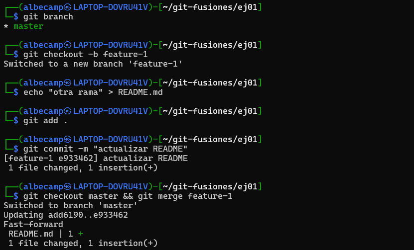
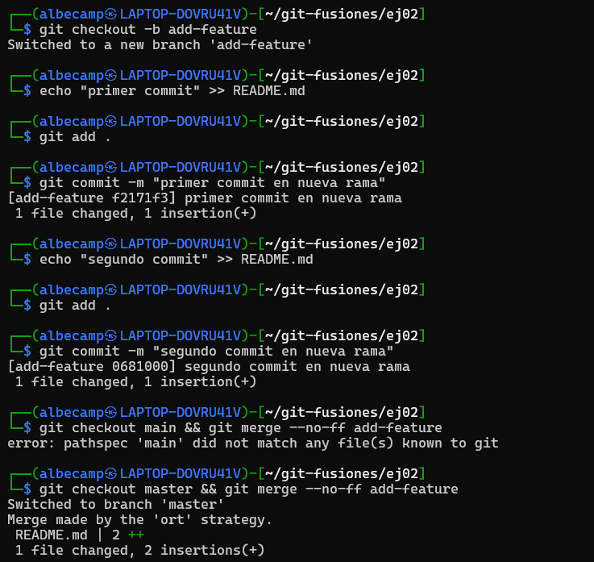
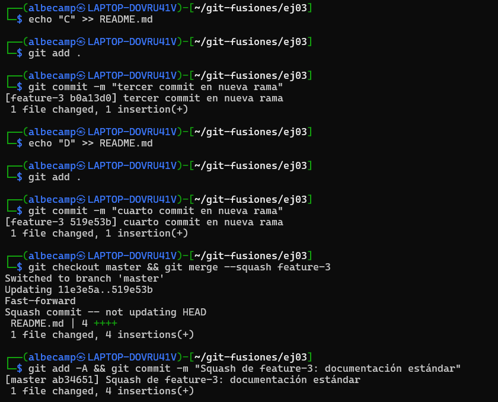
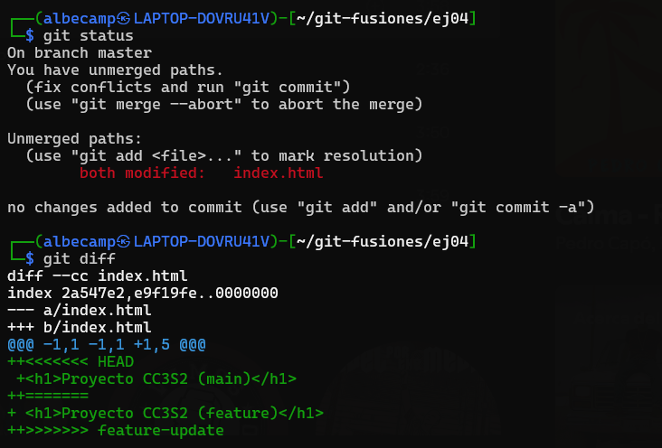
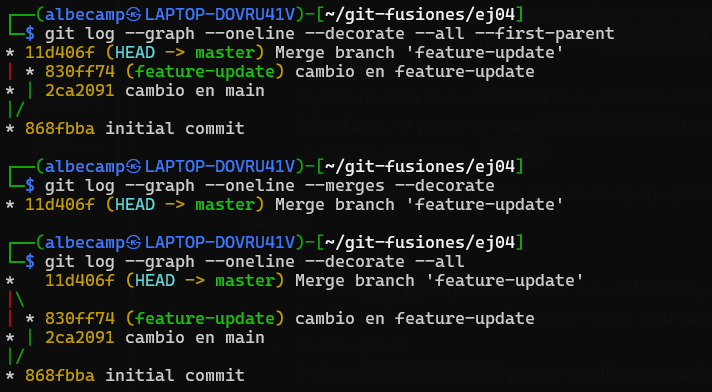

# Actividad7_CC3S2

## **Ejercicios guiados**

#### **A) Evitar (o no) `--ff`**

- **Pregunta:** ¿Cuándo evitarías `--ff` en un equipo y por qué?

    Se evitaría usar `--ff` cuando se trabaja en equipo y se quiere mantener un historial de commits bien detallado, para ver los momentos donde se han fusionado ciertas ramas.

#### **B) Trabajo en equipo con `--no-ff`**

- **Pregunta:** ¿Qué ventajas de trazabilidad aporta? ¿Qué problemas surgen con exceso de merges?

    Cuanda se trabaja de forma paralela en dos ramas y se quiere fusionar los cambios hechos en dichas ramas a la rama principal, cada `merge` creará un commit de la fusión. La ventaja es que se podría visualizar de manera clara donde comenzó y terminó cada trabajo, sobretodo ver los commits pertenecen a cada rama. Ahora, el exceso de merges podría llenar el historial de commits con varios commits de `merge`, haciendo difícil ver el historial.

#### **C) Squash con muchos commits**

- **Pregunta:** ¿Cuándo conviene? ¿Qué se pierde respecto a merges estándar?

    La opción `--squash` conviene usar cuando se hacen varios commits en un rama, donde los cambios no son tan grandes o no aportan tanto al historial de commits general, todo esto con el fin de mantener el historial de commits limpio. Sin embargo, aplicar esta opción puede hacer perder información importante para el desarrollo ya que se dificultaría el rastreo de cambios específicos.

---

## **Conflictos reales con no-fast-forward**

**Preguntas:**

- ¿Qué pasos adicionales hiciste para resolverlo?  
Debido a la aparición del conflicto en la misma linea del archivo, se tuvo que solucionar manualmente el conflicto. En este caso se usó `nano` para editarlo directamente y se optó por mantener los dos cambios hechos: en `main` y en `feature-update`.
- ¿Qué prácticas (convenciones, PRs pequeñas, tests) lo evitarían?  
Para evitar estos conflictos podría ser una buena opción trabajar en diferentes archivos, optar por la comunicación en el equipo o unir los cambios con más frecuencia.

---

## **Comparar historiales tras cada método**

**Preguntas**

- ¿Cómo se ve el DAG en cada caso?
    - Con `--first-parent`:  
El grafo se ve como una sola línea principal que sigue el historial de la rama `master`, mostrando solo los commits que están de forma directa, sin mostrar los detalles de las ramas fusionadas.
    - Con `--merges`:  
El grafo muestra únicamente los commits de tipo merge. En este caso, aparece solo el commit de la fusión de `feature-update` a `master`.
    - Con `--all`:  
El grafo muestra todo el historial, incluyendo las ramas y sus commits individuales. Se puede ver que `feature-update` tiene un commit propio y luego fue fusionado a `master`.

- ¿Qué método prefieres para: trabajo individual, equipo grande, repos con auditoría
    - Trabajo individual:  
Prefiero `--all` porque permite ver todo el historial y no se pierde detalles de los commits realizados en ramas secundarias.
    - Equipo grande:  
Prefiero `--first-parent` ya que simplifica la visualización del historial principal y reduce la confusión con varias ramas activas.
    - Repos con auditoría estricta:  
Prefiero `--merges` porque resalta las fusiones y facilita la revisión de cuándo y cómo se añadieron cambios de ramas secundarias.